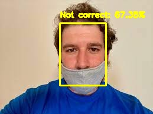
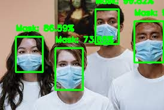
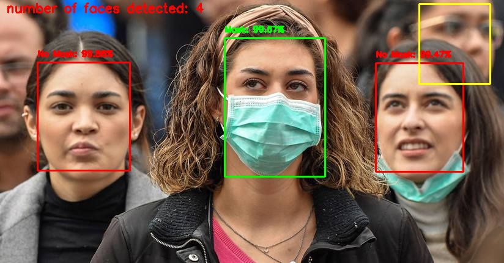

# face-mask-detection3classes

## Open the taining_model.ipynb notebook to train your face mask detector with three classes -preferably use google colab for the training

## Run the Uni_face_model.ipynb for our uni faces model

## Run the Multi_faces.ipynb for our multi faces model

### Download the dataset containing 5302 images within three different classes Masked, not masked, mask not correctly worn.
### Download the yolov-face weights at https://drive.google.com/drive/folders/1oj9p04mPjbbCbq1qSK8ChMjOhMLMpk42 and place them at the weights folder
